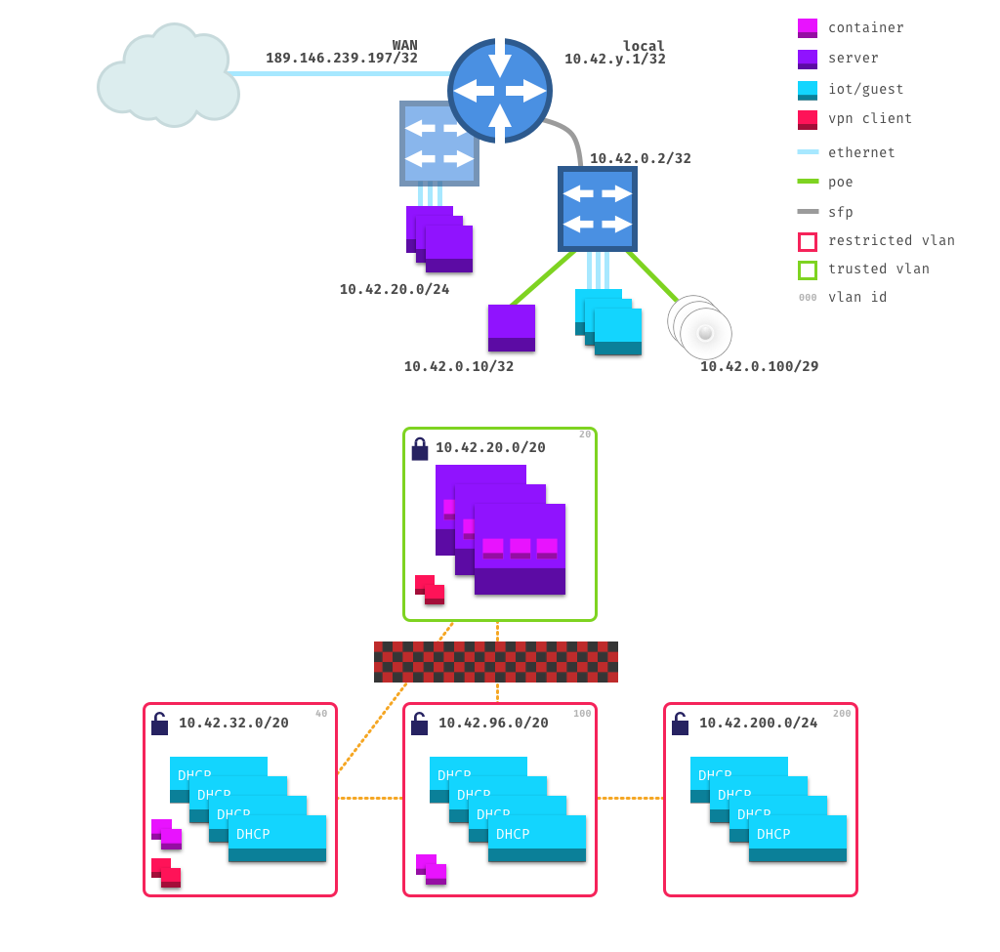

## Physical

### Router @ `10.42.0.1`

- `eth0`/`switch0`: chapultepec (bond)
- `eth1`/`switch0`: chapultepec (bond)
- `eth2`/`switch0`: ajusco
- `eth3`/`switch0`: xitle
- `eth4`/`switch0`: tepeyac
- `eth5`/`switch0`: _unused_
- `eth6`/`switch0`: _unused_
- `eth7`/`switch0`: _unused_
- `eth8`: _unused_
- `eth9`: wan
- `eth10` (sfp): _unused_
- `eth11` (sfp): switch @ `10.42.0.2`

### Switch @ `10.42.0.2`

- `eth0`: ap0 @ `10.42.0.100`
- `eth1`: ap1 @ `10.42.0.101`
- `eth2`: ap2 @ `10.42.0.102`
- `eth3`: cloudkey @ `10.42.0.10`
- `eth4`: apoltivi
- `eth5`: hueberto
- `eth6`: suich
- `eth7`: _unused_
- `eth8` (sfp): _unused_
- `eth9` (sfp): router @ `10.42.0.1`

## VLANs

### Trusted - 20

- **Range**: `10.42.20.0/20`
- **Reservations**:
  - chapultepec: `10.42.20.2`
  - ajusco: `10.42.20.3`
  - xitle: `10.42.20.4`
  - tepeyac: `10.42.20.5`
  - tláloc: `10.42.30.3`
  - chiquhuite: `10.42.30.4`
  - citlaltépetl: `10.42.30.5`
  - zempoala: `10.42.30.6`
- **Containers**: `10.42.2{2-8}.0/23`
- **DHCP**: `10.42.30.0/24`
- **VPN**: `10.42.31.0/24`

### Shared - 40

- **Range**: `10.42.32.0/20`
- **DHCP**: `10.42.40.0/24`
- **Containers**: `10.42.3{2-8}.0/23`
- **VPN**: `10.42.41.0/24`

### Robotitos - 100

- **Range**: `10.42.96.0/20`
- **DHCP**: `10.42.100.0/24`
- **Reservations**:
  - apoltivi: `10.42.100.2`
  - hueberto: `10.42.100.3`
  - suich: `10.42.100.4`
- **Containers**: `10.42.10{2-8}.0/23`

### Guests - 200

- **Range**: `10.42.200.0/24`
- **DHCP**: `10.42.200.0/24`

## IP Range overview

- `10.42.0.0/16`
  - `10.42.0.0/24` network devices
    - `10.42.0.1` router
    - `10.42.0.2` switch
    - `10.42.0.10` cloudkey
    - `10.42.0.10{0,n}` ap
  - `10.42.{1-19}.0/24` reserved
  - `10.42.20.0/20` trusted network
    - `10.42.20.0/24` servers
    - `10.42.21.0/24` reserved
    - `10.42.2{2-9}.0/24` containers from `10.42.20.{2-9}`
    - `10.42.30.0/24` trusted dhcp
    - `10.42.31.0/24` trusted vpn
  - `10.42.32.0/20` home network
    - `10.42.3{2-9}.0/24` containers from `10.42.20.{2-9}`
    - `10.42.40.0/24` home dhcp
    - `10.42.41.0/24` home vpn
    - `10.42.42.0/24` reserved
  - `10.42.96.0/20` robotitos network
    - `10.42.100.0/24` appliance dhcp
    - `10.42.10{2-9}.0/24` containers from `10.42.20.{2-9}`
  - `10.42.200.0/24` guest dhcp

## SSIDs

- `␖/␆`: trusted vlan
- `📡`: home vlan
- `robotitos`: robotitos vlan
- `mi wifi es su wifi`: guest vlan

## TODO

Do macvlan for containers. See [here](https://kcore.org/2020/08/18/macvlan-host-access/).
