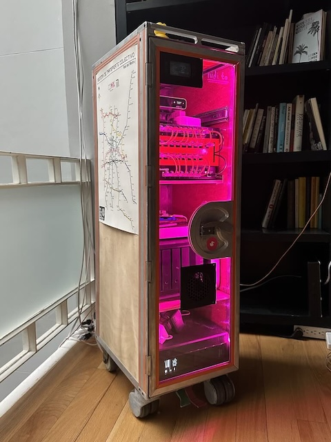

# nidito

A repository to hold the code running (in) my homelab.

## Description

My homelab runs on a diverse set of machines, and there's a bunch of workloads I'be been playing with in it. I don't quite know what I'm doing, so I wanna make sure it's less of a pain when it comes time to upgrade/undo/redo. Hardware fails, I tend to trip over ethernet, and thus this lab's automation and design is focused on allowing me to be as lazy and chill about failure as possible.

Most things these days can and will run great with docker, and some things will be better off running outside a container. A few essential services run like this and those are provisioned on nodes with ansible. Every other workload is scheduled with nomad.

### Hardware

Power efficiency is the name of the game; I started with a 40 watt/hour budget which has slowly grown along the amount of hardware in my rack. Now we're on a 100 watt/hour budget, which I wanna try to stick to for a long time.

- **edgerouter 12p**: Runs network-y stuff like every other router
- **edgeswitch 8-150**: feeds POE to my APs
- **unifi cloud key 2+**: A glorified access-point manager and network dashboard
- **synology dsm918+**: 4-bay NAS with a little transcoding power
- **macmini server** _late 2011_: donated by the Rodas Hardware Adoption Agency
- **raspberry pi 4** _late 2021_: 2x 8gb of ram 64-bit arm microcomputer
- **macmini m2** _early 2023_: Needed something that'll run latest macOS for a while
- **vultr 2C-4GB**: runs my personal website and projects in _the cloud_

These happily chug along inside my little rack, converted from an ATLAS half-size airline trolley.

#### Previous Hardware

- pixiepro named `ajusco`: quad-core 32-bit ARM microcomputer; second to join the cluster, now a stream box.
- macbook pro 13" _mid 2011_ named `xitle`: Broken screen, found on the streets of Brooklyn.
- macbook pro 15" _mid 2014_ named `tláloc`: Old personal laptop.

### Services

These hosts run a few services I think of in three layers, in descending order of essentialness:

0. **network** provide a working local+remote network, and dns resolution
1. **workload** provide the runtime, scheduler, configuration, storage, logging, and load balancing for other services
2. **home** turn on the lights, media streaming, long-term storage, backup
3. **et al** everything else

#### Network services

Without a working **network**, either wired, wireless or through a vpn, nothing else works. Apart from regular network-y services, the router runs:

- **DNS**: `coredns` forwards and caches queries (ad-blocking tbd) to the internet at large. Queries to *.nidi.to from within internal networks dynamically resolve from consul.
- **VPN**: `wireguard` runs a site-to-site to a "cloud" DC as well as allowing me to connect outside these walls.

#### Workload services

`consul`, `nomad` and `vault` provide the basis for running **workload**s and doing the service discovery/config dance. Along DNS and VPN, I consider these services "tier-1", as everything else is dead without it.

tier-2 services provide nicer abstractions for roberto, the power-user, to run stuff on. These services are:

- **http-proxy**: nginx runs on every leader node, terminating SSL and proxying requests to every other service.
- **docker-registry**: a container image registry
- **telemetry**: `prometheus`, `grafana` and `loki` to get an idea of what's happening inside these boxes
- **op-connect**: for keeping the secrets that are needed to spin up shit
- **ssl-renewal**: things need certs
- **consul-backup**: most of the important shit in my lab ends up in consul

Finally, there's tier-3 services that actually do stuff for humans in my home:

- [**radio**](https://rudi.to): radio pipeline to record and stream _ruiditos_
- **cajon**: s3-compatible drawer to put all my bytes in, i.e. `garagehq`
- **media-pipeline**: downloads media files, renames them and ships them to plex
- **plex**: self-hosted media streaming service, including my personal recordings
- [**home-assistant**](https://www.home-assistant.io/)
- **event-gateway**: glorified nomad job dispatcher triggered by http webhooks

Previously, I've also ran:

- [**puerta**](https://git.rob.mx/nidito/puerta): hacked my door so I don't have to open for friends and family
