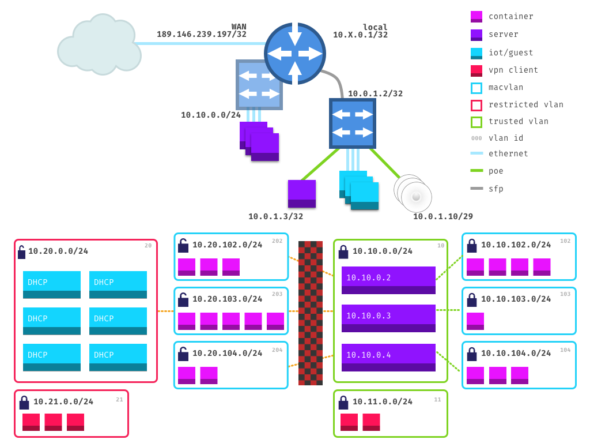

# Network

## Physical

### Router @ `10.0.0.1`

- `eth0`/`switch0`: chapultepec (bond)
- `eth1`/`switch0`: chapultepec (bond)
- `eth2`/`switch0`: ajusco
- `eth3`/`switch0`: xitle
- `eth4`/`switch0`: _unused_
- `eth5`/`switch0`: _unused_
- `eth6`/`switch0`: _unused_
- `eth7`/`switch0`: _unused_
- `eth8`: _unused_
- `eth9`: wan
- `eth10` (sfp): switch @ `10.0.1.2`
- `eth11` (sfp): _unused_

### Switch @ `10.0.1.2`

- `eth0`: ap0 @ `10.0.1.10`
- `eth1`: ap1 @ `10.0.1.11`
- `eth2`: ap2 @ `10.0.1.12`
- `eth3`: _unused_
- `eth4`: _unused_
- `eth5`: _unused_
- `eth6`: _unused_
- `eth7`: cloudkey @ `10.0.1.3`
- `eth8` (sfp): router @ `10.0.0.1`
- `eth9` (sfp): _unused_

## VLANs

### Trusted - `10.10.0.0/16`

Hosts: `10.10.0.0/24`

Reservations:
  - (router-eth0+1) Chapultepec: `10.10.0.2`
  - (router-eth2) Ajusco: `10.10.0.3`
  - (router-eth3) Xitle: `10.10.0.4`
  - Tláloc: `10.10.0.10`
  - Chiquhuite: `10.10.0.11`
  - Citlaltepetl: `10.10.0.12`

Containers:`10.10.1y.0/24`, `y := sprintf("%0d", lastOctet(host.address))`, i.e. `10.10.102.0/24` for host address `10.10.0.2`

VPN: `10.11.0.0/24`

### Shared - `10.20.0.0/16`

Hosts: `10.20.0.0/24`

Reservations:
  - (switch-eth3) Apoltivi: `10.20.0.2/24`
  - (switch-eth4) Hueberto: `10.20.0.3/24`
  - (switch-eth5) Suich: `10.20.0.4/24`

DHCP:
  - BR30
  - Strip
  - Lock
  - Wemo
  - Outdoors

VPN: `10.21.0.0/24`

Containers: `10.20.1y.0/24`, `y := sprintf("%0d", lastOctet(host.address))`, i.e. `10.20.110.0/24` for host address `10.10.0.10`
